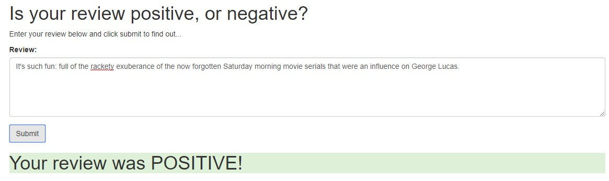
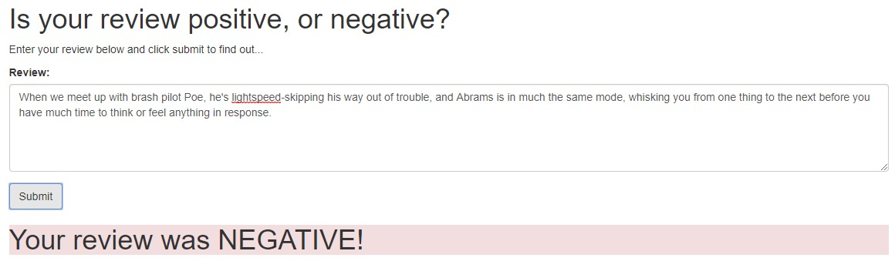

# Udacity Deep Learning Nanodegree - deployment of sentiment analysis model on AWS SageMaker

In this project, a RNN deep learning model is built and deployed on AWS SageMaker and a web application is running to conduct sentiment analysis of [IMDb dataset](http://ai.stanford.edu/~amaas/data/sentiment/). The original code is in [Udacity SageMaker Deployment repository](https://github.com/udacity/sagemaker-deployment).

## Tools/Framwork include:
- AWS SageMaker
- AWS S3
- AWS Lambda
- AWS Gateway API
- Pytorch

## General Steps include:
- Download or otherwise retrieve the data.
- Process / Prepare the data.
- Upload the processed data to S3.
- Train a chosen model.
- Test the trained model (typically using a batch transform job).
- Deploy the trained model.
- Use the deployed model.

## Deployment Process using AWS:
 

## Final Results:
Positive movie review:
 
Negative movie review:
 
